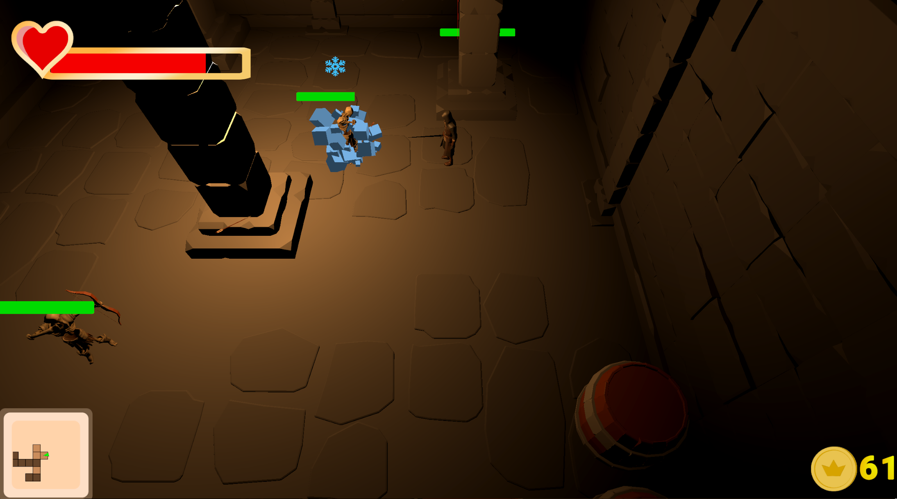

# Rogue-like Game

**Жанр:** Rogue-like  
**Движок:** Unity  
**Язык:** C#  

Rogue-like игра с процедурной генерацией уровней, уникальными предметами, боевой системой на основе finite state machine (FSM) и множеством дополнительных механик.

---

## Основные механики

- **Процедурная генерация уровней**  
  Алгоритм на основе присоединяющихся друг к другу комнат

- **Боевая система (FSM)**  
  Игрок может:
  - Совершать перекаты
  - Атаковать мечом в направлении курсора
  - Совершать комбо-удары

- **Враги ближнего и дальнего боя (FSM)**  
  Управляются собственными finite state machine:
  - Ближний бой — преследуют и атакуют вблизи
  - Дальники — стреляют с расстояния

- **Система предметов (ScriptableObjects)**  
  Новые предметы можно создавать прямо в Unity Editor:
  - Улучшают характеристики персонажа
  - Легко расширяются без изменения кода

- **Система статусных эффектов (ScriptableObjects)**  
  Можно создавать новые эффекты (яд, заморозка, поджог и т.д.) в Unity и прикреплять их к предметам.

- **Диалоговая система с редактором**  
  Редактор диалогов, в котором можно создавать, редактировать, сохранять и загружать диалоги
  Диалоги можно воспроизводить в игре
  При повторной встрече с персонажем воспроизводится следующий по порядку диалог

- **Система покупки предметов за золото**  
  После победы над врагом из негшо выпадает золото
  Игрок может поторатить золото на покупку предметов в магазине

- **Ловушки**  
  Огненная ловушка:
  - Наносит урон
  - Накладывает статусный эффект на игрока или врага

- **Система выпадения предметов из бочек**  
  - Разрушаемые бочки  
  - Шанс выпадения предмета и конкретный дроп настраиваются в редакторе

---

## Скриншоты

  
  
  
  

  
  

  
  
  
  

  

  
  

---

## Технологии
- Unity (C#)
- ScriptableObjects
- Finite State Machine (FSM) для боёвки и AI
- NavMesh 
- Custom Unity Editor Tools
- Canvas UI
- Git

---

## Скачать билд
https://github.com/Nlomin/Rohue-like-game/releases/tag/v0.1.0-prototype

## Видео-презентация проекта
https://youtu.be/wYk2SM8I4CE
